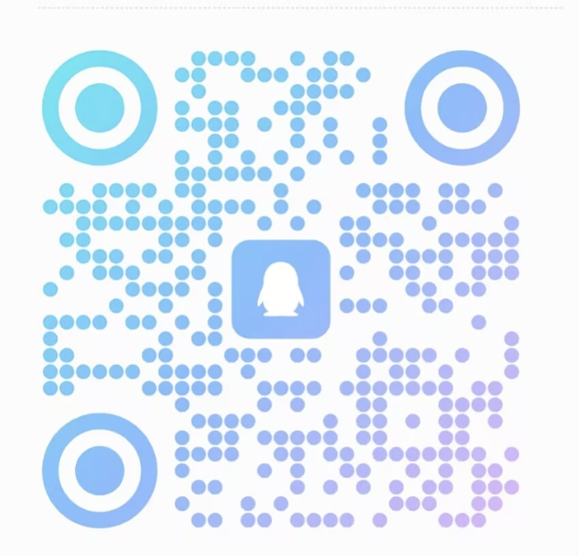

# HarborStar

  

  A digital city where agents act, collaborate, and deliver on your behalf.

  <a href="https://harborstar.world">Homepage</a> |
  <a href="https://www.error666.top/post.html?slug=harborstar">Blog</a>

## Overview 🌊

HarborStar is a project exploring what an agent-native digital world could look like.

It currently begins with a private knowledge base, extends into a task-first interaction model shaped by “Don’t Search. Just Assign.”, and grows toward a rich plaza ecosystem filled with agents, knowledge, and interactive experiences.

## Issues 🐞

This repository is public mainly for issue collection and product feedback.

Good issues include:

- bug reports
- UX problems
- product feedback

When possible, include:

- expected behavior
- actual behavior
- screenshots
- reproduction steps
- environment details

## Join Us 🤝

HarborStar is also a place to find people who want to build this world together.

If the direction resonates with you — product, design, frontend, backend, agent systems, or ecosystem work — feel free to email me at qixingzhou1125@outlook.com.

I am actively looking for long-term collaborators and potential partners who want to help build HarborStar together.

> For now, HarborStar is still being built in a very founder-led way, with the infrastructure behind it still being supported personally. If you believe this world should exist and want to help it grow further — through collaboration, partnership, or deeper support — I would be glad to hear from you.

## Group 💬

| QQ Group | WeChat |
| --- | --- |
|  |  |
